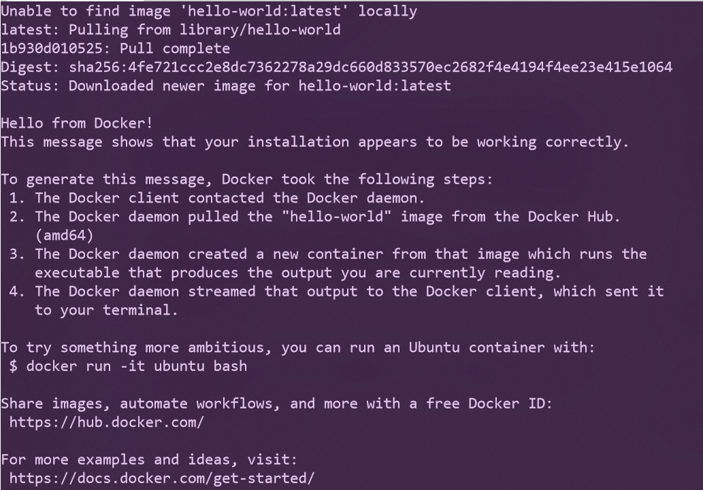

# Docker Desktop for Windows 與 Azure Kubernetes Service 實機操作


## Lab 1 驗證 Docker 環境正常運作
1.在命令列模式下執行以下指令 
```powershell
docker run --rm hello-world
```

2.如果順利如下圖般顯示出 **Hello from Docker!** 表示目前環境已經可以由 Docker client 連接到 Docker daemon，能夠順利自 Docker Hub 取得 hello-world 映像檔，並由此映像檔建立一個容器，**Hello from Docker!** 這段文句就是容器執行後產生的輸出，由 Docker daemon 傳送至 Docker clinet 顯示出來，由於附加了 --rm 參數執行完畢後就刪除了這個容器


3.在命令列模式下執行以下指令，可以列出所有下載的映像檔，包含了 hello-world 這個映像檔，請紀錄代表 hello-word 這個映像檔的 IMAGE ID
```powershell
docker images

```
應會顯示類似如下結果 :

| REPOSITORY  | TAG    | IMAGE ID     | CREATED       | SIZE   |
|-------------|--------|--------------|---------------|--------|
| hello-world | latest | fce289e99eb9 | 12 months ago | 1.84kB |

4.在命令列模式下執行以下指令清除 hello-world 映像檔，復原環境
```powershell
docker rmi <IMAGE ID>
```
* [前往練習 Lab 2](Labs-02.md)
* [返回 README](README.md)