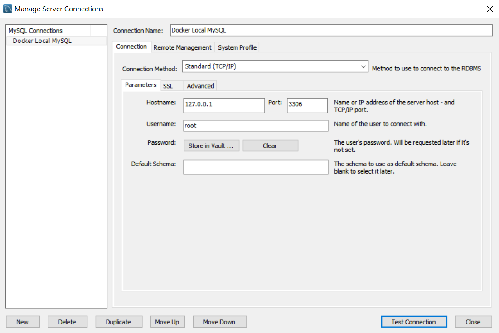

# Docker Desktop for Windows 與 Azure Kubernetes Service 實機操作


## Lab 2 以本機共享磁碟 Host Volume 方式建立 MySQL 8 容器
1.以瀏覽器連線到 [Docker Hub](https://hub.docker.com/_/mysql) 之官方映像檔了解目前支援之 MySQL 版本與對應標籤

2.在命令列模式下執行以下命令，下載 MySQL 8 官方映像檔
```powershell
docker pull mysql:8
```
3.如下以 PowerShell 建立兩個資料夾以便未來對應 MySQL 在 Linux 容器內的資料庫檔案與組態配置檔案之路徑
```powershell
mkdir $HOME/docker/mysql;
mkdir $HOME/docker/mysql-conf
```

4.在 PowerShell 命令列模式下執行以下命令，建立 MySQL 8 容器
```powershell
docker run `
-d `
-v $HOME/docker/mysql:/var/lib/mysql `
-v $HOME/docker/mysql-conf:/etc/mysql/conf.d `
-e MYSQL_ROOT_PASSWORD=<資料庫密碼> `
-p 3306:3306 `
mysql:8 `
--character-set-server=utf8mb4 `
--collation-server=utf8mb4_unicode_ci `
--default-authentication-plugin=mysql_native_password
```

說明各項參數代表的意義
* docker run -d 是建立容器並在背景持續執行
* -v 建立 Host Volume 以 <本機資料夾>:<容器內路徑> 之間對應關係
* -e 透過系統環境變數 MYSQL_ROOT_PASSWORD 指定 root 帳號之密碼
* -p 建立 <本機開啟 Port>:<容器內對應之 Port>
* mysql:8 所使用的映像檔
* --character-set-server=utf8mb4 設定 MySQL 參數以支援 UTF8
* --collation-server=utf8mb4_unicode_ci 設定 MySQL 參數以支援 UTF8
* --default-authentication-plugin=mysql_native_password MySQL 8 預設 caching_sha2_password 與 WordPress 5.3.2 等許多既有軟體不相容，設定使用原生密碼模式以增加相容性

5.在命令列模式下執行以下命令，確認目前 MySQL 容器有成功建立並執行，並記錄代表此容器之 CONTAINER ID

```powershell
docker ps
```
應會顯示類似如下結果 :

| CONTAINER ID | IMAGE   | COMMAND                | CREATED       | STATUS | PORTS                              | NAMES          |
|--------------|---------|------------------------|---------------|--------|------------------------------------|----------------|
| 66f8280f7650 | mysql:8 | "docker-entrypoint.s…" | 2 minutes ago |  Up 6 seconds | 0.0.0.0:3306 -> 3306/tcp, 33060/tcp | reverent_haibt |

6.在 PowerShell 命令列模式下執行以下命令，可以看到 MySQL 容器所建立的相關資料庫檔案

```powershell
dir $HOME/docker/mysql
```

7.安裝 [Visual Studio Code](https://github.com/cweijan/vscode-mysql) 之 MySQL 延伸套件，或 [MySQL Workbench](https://dev.mysql.com/downloads/workbench/)，以 root 帳號與之前設定之密碼連線到 localhost 的 Port 3306 驗證資料庫已經順利運行



8.在命令列模式下執行以下命令，停止執行容器
```powershell
docker stop <CONTAINER ID>
```

9.此時將無法順利連線到此 MySQL 容器，在命令列模式下執行以下命令，將不顯示此容器，因為這個容器已經停止執行了
```powershell
docker ps
```

| CONTAINER ID | IMAGE   | COMMAND                | CREATED       | STATUS | PORTS                              | NAMES          |
|--------------|---------|------------------------|---------------|--------|------------------------------------|----------------|
| | | | | | | 


10.而此 MySQL 容器仍然存在，只是沒有被執行，下執行以下命令將可看到已經成功建立的所有容器
```powershell
docker ps -a
```
應會顯示類似如下結果 :

| CONTAINER ID | IMAGE   | COMMAND                | CREATED       | STATUS | PORTS                              | NAMES          |
|--------------|---------|------------------------|---------------|--------|------------------------------------|----------------|
| 66f8280f7650 | mysql:8 | "docker-entrypoint.s…" | 8 minutes ago | Exited (0) 2 minutes ago |  | reverent_haibt |

11.在命令列模式下執行以下命令，可以重新執行此 MySQL 容器，啟動執行後可以再度以資料庫工具連線測試確認是否已經正常運行
```powershell
docker start <CONTAINER ID>
```

12.在命令列模式下執行以下命令，停止容器執行並刪除容器
```powershell
docker rm <CONTAINER ID> -f
```

13.在 PowerShell 命令列模式下執行以下命令，刪除資料庫檔案
```powershell
rmdir $HOME/docker
```

14.可依據 Lab 1 所學，找出下載之 MySQL 映像檔並刪除以恢復為原始環境

* [前往練習 Lab 3](Labs-03.md)
* [返回 README](README.md)
