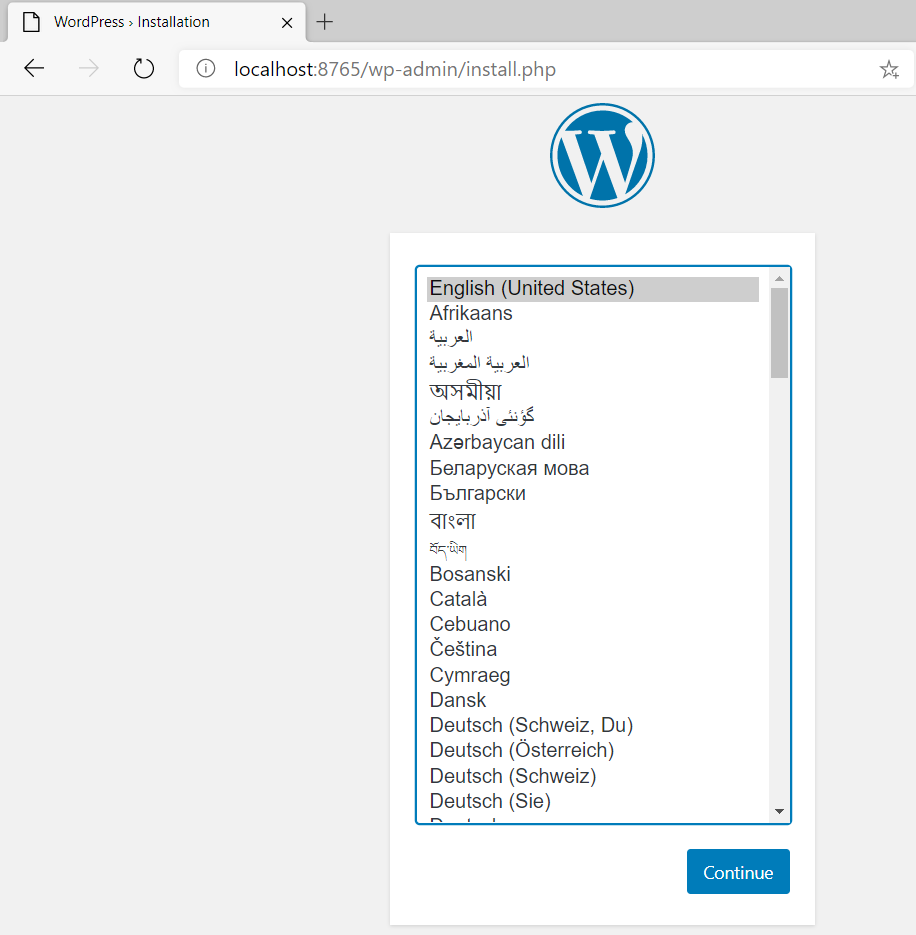

# Docker Desktop for Windows 與 Azure Kubernetes Service 實機操作


## Lab 3 以 Docker Compose 使用 Name Volume 方式建立 Wordpress 5.3 與 MySQL 8 容器

1.建立一個資料夾名為 Wordpress

2.以編輯器在該資料夾內建立一個 docker-compose.yaml 檔案內容如下，亦可以[直接下載預先備妥之檔案使用](./Labs-03/docker-compose.yaml)

```yaml
version: '3.1'

services:
  
  mysql:
    image: mysql:8
    # MySQL 8 預設 caching_sha2_password 與 WordPress 5.3.2 不相容
    # 因此先改用原生密碼模式，並設定支援 UTF8 編碼
    command: --default-authentication-plugin=mysql_native_password --character-set-server=utf8mb4 --collation-server=utf8mb4_unicode_ci
    # 以 Name Volume 方式定義名為 db_data 的 Volume 儲存資料庫檔案
    volumes:
      - db_data:/var/lib/mysql
    restart: always
    # 以環境變數設定相關帳號密碼與資料庫
    environment:
      MYSQL_ROOT_PASSWORD: wordpress
      MYSQL_DATABASE: wordpress
      MYSQL_USER: wordpress
      MYSQL_PASSWORD: wordpress

  wordpress:
    depends_on:
      - mysql
    image: wordpress:5.3
    # Wordpress 在本機 8765 Port 提供存取
    ports:
      - "8765:80"
    restart: always
    # 以環境變數設定連線帳號密碼與資料庫主機名稱與開放的 Port
    environment:
       WORDPRESS_DB_HOST: mysql:3306
       WORDPRESS_DB_USER: wordpress
       WORDPRESS_DB_PASSWORD: wordpress
       WORDPRESS_DB_NAME: wordpress

volumes:
  db_data: {}
```

3.在命令列模式下，進入 docekr-compose.yaml 所在的資料夾，執行以下命令建立與執行 MySQL 與 Wordpress 這一組彼此關聯的容器，-d 意即可在背景執行此組容器

```powershell
docker-compose up -d
```

4.在命令列模式下，執行以下命令確認兩個容器已經順利執行
```powershell
docker ps
```
應會顯示類似如下結果 :

| CONTAINER ID | IMAGE   | COMMAND                | CREATED       | STATUS | PORTS                              | NAMES          |
|--------------|---------|------------------------|---------------|--------|------------------------------------|----------------|
| 1827b1fbcdc6 | wordpress:5.3 | "docker-entrypoint.s…" | 23 seconds ago |  Up 22 seconds |  0.0.0.0:8765 -> 80/tcp | wordpress_wordpress_1 |
| fb480cf7af28 | mysql:8 | "docker-entrypoint.s…" | 24 seconds ago |  Up 23 seconds | 3306/tcp, 33060/tcp | wordpress_mysql_1 |


5.以瀏覽器連接 http://localhost:8765 即可看見 Wordpress 首次執行安裝畫面



6.在命令列模式下，執行以下命令停止執行並刪除相關聯的兩個容器
```powershell
docker-compose down
```

7.在命令列模式下執行以下命令，可以看見所 MySQL 容器所建立為了永續保存資料之 Name Volume，請紀錄此 VOLUME NAME。
```powershell
docker volume ls
```
應會顯示類似如下結果 :

| DRIVER | VOLUME NAME       |
|--------|-------------------|
| Local  | wordpress_db_data |

8.在命令列模式下即可刪除該 Volume
```powershell
docker volume rm <VOLUME NAME>
```

9.可依據 Lab 1 所學，找出下載之 MySQL 與 Wordpress 映像檔並刪除以恢復為原始環境

* [前往練習 Lab 4](Labs-04.md)
* [返回 README](README.md)