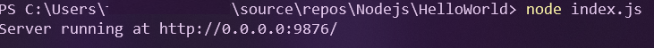
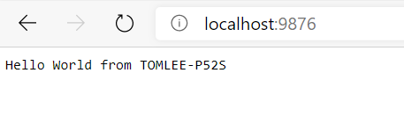
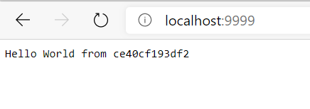

# Docker Desktop for Windows 與 Azure Kubernetes Service 實機操作


## Lab 4 建立一個 Nodejs 網頁程式之 Docker 映像檔與容器

1.命令列模式下，如下鍵入命令確認 Nodejs 環境正確安裝，並且版本號碼為 12 以上版本
```powershell
node -v
```

2.建立妥一個資料夾名為 HelloWorld 資料夾，在此資料夾中以編輯器建立一個名為 index.js 檔案如下，亦可以[直接下載預先備妥之檔案使用](Labs-04/index.js)

```javascript
const http = require("http");
const os = require("os");

const ipv4 = "0.0.0.0";
const port = 9876;
const computerName = os.hostname();

const server = http.createServer((req, res) => {
  res.statusCode = 200;
  res.setHeader("Content-Type", "text/plain");
  res.end("Hello World from "+computerName);
});

server.listen(port, ipv4, () => {
  console.log(`Server running at http://${ipv4}:${port}/`);
});
```

3.命令列模式下，在 HelloWorld 資料夾內鍵入如下命令，確認一個網頁伺服器已經如下圖順利執行，並於 Port 9876 上準備接收 HTTP 請求

```powershell
node index.js
```


4.開啟瀏覽器連線至本機 http://localhost:9876 測試此 Nodejs 網頁應用程式，預期如下圖般順利執行回傳 Hello Wolrd 字樣網頁，而畫面中則該顯示您的電腦名稱。



5.命令列模式下鍵入 Ctrl-C 終止 node index.js 之執行，此時開啟瀏覽器連線至本機 http://localhost:9876 將無法順利顯示網頁

6.在 HelloWorld 資料夾中以編輯器建立一個名為 Dockerfile 的檔案如下，亦可以[直接下載預先備妥之檔案使用](Labs-04/Dockerfile)

```dockerfile
# 由 Docker Hub 官方版本 node:12 映像檔為基礎
FROM node:12

# 建立應用程式所在目錄
WORKDIR /usr/src/app

# 複製目前程式
COPY . .

# 開放 Port
EXPOSE 9876

# 容器執行即自動執行 node index.js
CMD [ "node", "index.js" ]
```

7.在命令列模式下，在 HelloWorld 資料夾內鍵入如下命令，開始建立此應用程式之 Docker 映像檔，並且以 nodejs-app:1.0 作為這個映像檔版本辨識用的標籤
```powershell
docker build -t nodejs-app:1.0 .
```

8.在命令列模式下，鍵入如下命令確認映像檔已經順利建立完成，請紀錄 IMAGE ID
```powershell
docker images
```

應會顯示類似如下結果 :
| REPOSITORY  | TAG    | IMAGE ID     | CREATED       | SIZE   |
|-------------|--------|--------------|---------------|--------|
| nodejs-app | 1.0 | 148ab6e0b173 | 14 seconds ago | 913MB |


9.在命令列模式下，鍵入如下命令即可了解剛才所建立的這個映像檔的歷史修改紀錄，與他的組成內容
```powershell
docker history <IMAGE ID>
```

10.在命令列模式下，鍵入如下命令建立容器，能夠在背景執行狀況下於 Port 9999 上準備接收 HTTP 請求
```powershell
docker run -d -p 9999:9876 nodejs-app:1.0 
```
11.開啟瀏覽器連線至此容器 http://localhost:9999 測試此 Nodejs 網頁應用程式，預期如下圖般順利執行回傳 Hello Wolrd 字樣網頁，如果鍵入以下指令
```powershell
docker ps
```
我們也可發現 Nodejs 程式所取得的電腦名稱與 CONTAINER ID 會相符。



12.可依據 Lab 2 所學，將停止容器執行並刪除容器。而此應用程式映像檔暫時保留做為 Lab 5 使用。

* [前往練習 Lab 5](Labs-05.md)
* [返回 README](README.md)