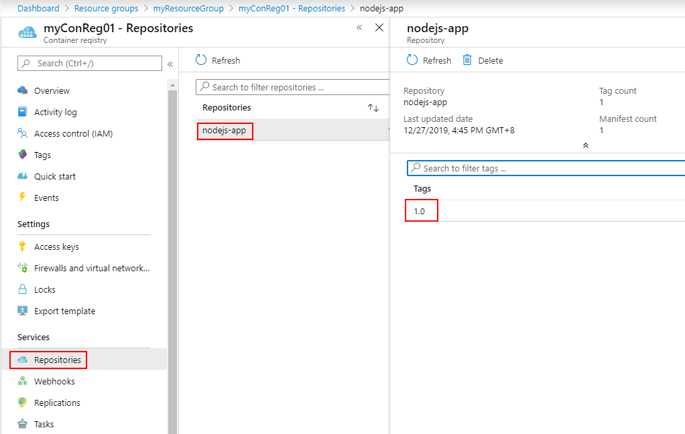

# Docker Desktop for Windows 與 Azure Kubernetes Service 實機操作


## Lab 5 將 Docker 映像檔推送至 Azure Container Registry

### 建立 Azure Container Registry (ACR)

1.在命令列模式下，如下鍵入指令以確認目前環境已經安裝妥了 Azure CLI 2.0.80 之後版本，若版本太舊或沒有安裝 Azure CLI 先[下載](https://docs.microsoft.com/zh-tw/cli/azure/install-azure-cli?view=azure-cli-latest) 並安裝妥 Azure CLI。 
```powershell
az --version
```

2.在命令列模式下，如下鍵入指令登入 Microsoft Azure

```powershell
az login
```

3.若您的訂閱帳號具備足夠權限，在命令列模式下，如下鍵入指令建立一個名為 myResourceGroup 位於 Azure 東南亞資料中心之資源群組 (Resource Group)

```powershell
az group create -n myResourceGroup -l southeastasia
```

4.已至少五個小寫英文或數字組成的 <ACR 名稱>，如下命令即可建立一個私有的標準版 Azure Container Registry (ACR)，**<ACR 名稱>.azurecr.io** 這個名稱將代表您的伺服器，因此必須絕對唯一，如果已經有其他微軟用戶選擇了相同名稱則無法順利建立，請更換一個新的名稱重新嘗試建立，建立成功後請紀錄此 <ACR 名稱>，並可至 [Azure Portal](https://portal.azure.com) 內尋找 myResourceGroup 確認已經順利建立成功。

```powershell
az acr create -g myResourceGroup -n <ACR 名稱> --sku Basic
```

### 將 Docker 映像檔推送至 Azure Container Registry (ACR)

1.在命令列模式下，如下鍵入指令登入之前所建立的 Azure Container Registry (ACR)
```powershell
az acr login -n <ACR 名稱>  
```

2.將 Lab 4 所建立在本機的 nodejs-app:1.0 映像檔上，貼上未來在 Azure Container Registry 儲存的標籤 (Tag)，在此我們選擇使用相同的命名 nodejs-app:1.0，在命令列模式下，如下鍵入指令即可貼上標籤
```powershell
docker tag nodejs-app:1.0 <ACR 名稱>.azurecr.io/nodejs-app:1.0
```

3.在命令列模式下，如下鍵入指令確認標籤有順利貼上，由於是相同的映像檔 IMAGE ID 是相同的，僅有 REPOSITORY 名稱不同
```powershell
docker images
```
應會顯示類似如下結果 :

| REPOSITORY  | TAG    | IMAGE ID     | CREATED       | SIZE   |
|-------------|--------|--------------|---------------|--------|
| nodejs-app | 1.0 | 148ab6e0b173 | 36 seconds ago | 913MB |
| <ACR 名稱>.azurecr.io/nodejs-app | 1.0 | 148ab6e0b173 | 36 seconds ago | 913MB |

4.在命令列模式下，如下鍵入指令即可推送已標示標籤的映像檔至 Azure Container Registry (ACR)
```powershell
docker push <ACR 名稱>.azurecr.io/nodejs-app:1.0
```

5.以瀏覽器進入 [Azure Portal](https://portal.azure.com) 確認映像檔已經順利儲存於此一私有的 Azure Container Registry 之中。



亦可以透過 Azure CLI 列出此私有 Container Registry 內所有的 Respsitory 名稱
```powershell
az acr repository list -n <ACR 名稱> -o table
```
與更進一步列出某一 Repository 內所有標籤清單

```powershell
az acr repository show-tags -n <ACR 名稱> --repository <Repository 名稱> -o table
```

日後只要有權限存取此 Azure Container Registry 的帳號或 Azure 服務，即可以用 **<ACR 名稱>.azurecr.io/nodejs-app:1.0** 的名稱取用此映像檔，請暫時保留本 Lab 所建立之環境以供後續 Lab 使用。

* [前往練習 Lab 6](Labs-06.md)
* [返回 README](README.md)
