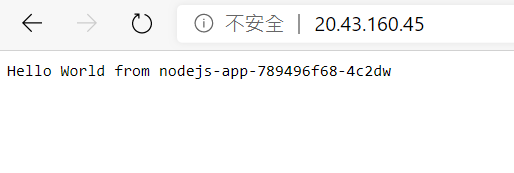
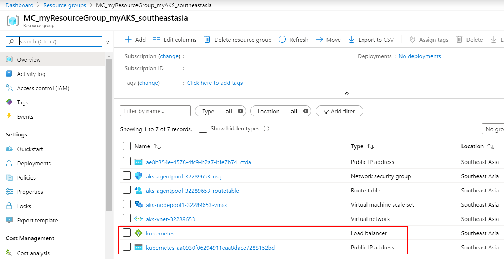

# Docker Desktop for Windows 與 Azure Kubernetes Service 實機操作

## Lab 7 部署 Nodejs 網頁程式至 Azure Kubernetes Service 叢集

1.Kubernetes 可以用 YAML 檔案格式定義需要建置的物件 (Object)，請在之前建立的 Lab 4 所建立的 HelloWorld 資料夾內，以編輯器建立一個名為 nodejs-app.yaml 的檔案如下，亦可以[直接下載預先備妥之檔案使用](Labs-07/nodejs-app.yaml)，請注意必須將檔案內的 <ACR 名稱> 替換為 Lab 5 中所建立的 Azure Container Registry (ACR) 名稱。

```yaml
apiVersion: apps/v1
# 定義物件 Deployment
kind: Deployment
metadata:
  # Deploy 名稱
  name: nodejs-app
spec:
  # 此 Deploy 確保維持 Pod 的數量
  replicas: 1
  selector:
    # 只有具備 app: nodejs-app 標籤之樣板內所定義的 Pod 才會被部署
    matchLabels:      
      app: nodejs-app
  template:
    metadata:
      # 定義樣板標籤
      labels:
        app: nodejs-app
    spec:
      containers:
      # Pod 名稱  
      - name: nodejs-app
        # 請填入您的 ACR 名稱
        image: <ACR 名稱>.azurecr.io/nodejs-app:1.0
        # 每次部署都重新取得映像檔
        imagePullPolicy: Always
        # 需要之運算資源
        resources:
          # 請求配置之運算資源
          requests:
            cpu: 100m
            memory: 128Mi
          # 限制最大可用之運算資源，可以避免節點資源用盡  
          limits:
            cpu: 250m
            memory: 256Mi
        # 接收請求的 Port 為 9876    
        ports:
        - containerPort: 9876
          name: nodejs-app
---
apiVersion: v1
# 定義物件 Service
kind: Service
metadata:
  # Service 名稱
  name: nodejs-app-svc
spec:
  # 以負載平衡型態對外服務
  type: LoadBalancer
  ports:
  # Service 對外開放存取之 Port 為 80，Pod 對外開放存取的 Port 為 9876
  - name: http
    targetPort: 9876
    port: 80
  selector:
    # 將相關連線只送入有 app: nodejs-app 標籤之 Pod
    app: nodejs-app
```
2.在此 nodejs-app.yaml 所在路徑由命令列模式下達以下指令
```powershell
kubectl apply -f nodejs-app.yaml
```
此命令執行後會依據 nodejs-app.yaml 定義建立三個 Kubernetes 物件，分別是 Pod , Deployment 與 Service。可鍵入以下指令

```powershell
kubectl get pod
```
如果 Pod 順利建立完成，應會顯示類似如下結果 :

| NAME                        | READY | STATUS  | RESTARTS | AGE |
|-----------------------------|-------|---------|----------|-----|
| nodejs-app-789496f68-4c2dw | 1/1   | Running | 0        | 50s |

而鍵入以下指令
```powershell
kubectl logs <Pod NAME>
```
即可看到容器原本 Console 輸出的內容

而鍵入以下指令
```powershell
kubectl get deploy
```
如果 Deploymenet 順利建立完成，應會顯示類似如下結果 :

| NAME       | READY | UP-TO-DATE | AVAILABLE | AGE |
|------------|-------|------------|-----------|-----|
| nodejs-app | 1/1   | 1          | 1         | 50s |

而鍵入以下指令
```powershell
kubectl get svc
```
則可顯示目前 Service 建立狀況，由於此 nodejs-app.yaml 定義要建立一個具備負載平衡器的 Service，因此 Microsoft Azure 必須配置一個對外公開的 IP Address 給此負載平衡器，因此需要花費數分鐘的時間，當負載平衡器順利建立完成，應會顯示類似如下結果 :

| NAME           | TYPE         | CLUSTER-IP | EXTERNAL-IP  | PORT(S)      | AGE |
|----------------|--------------|------------|--------------|--------------|-----|
| kubernetes     | ClusterIP    | 10.0.0.1   | \<none>       | 443/TCP      | 52m |
| nodejs-app-svc | LoadBalancer | 10.0.34.41 | 20.43.160.45 | 80:30791/TCP | 3m  |

以這個顯示結果，能夠以瀏覽器連線的對外公開的 IP Address 為 20.43.160.45。我們以瀏覽器連線測試，即可發現 Nodejs 程式所取得的電腦名稱與 Pod 名稱相符。



如果我們進入 [Azure Portal](https://portal.azure.com) 找到放置 Azure Kubernetes Service 相關節點之資源群組，可以發現因 "nodejs-app-svc" 所建立的 Azure Load Balancer 與 Public IP Address。




3.在命令列模式下達以下指令嘗試刪除特定 Pod

```powershell
kubectl delete pod <Pod 名稱>
```

再鍵入以下命令觀察該 Pod 是否被刪除
```powershell
kubectl get pod -w
```
我們會發現刪除該 Pod 之後，Kubernetes 重複再建立一個新的 Pod，始終維持著 nodejs-app.yaml 內 replicas: 1 所定義的數量。

4.在命令列模式下達以下指令嘗試刪除 "nodejs-app" 這個 Deployment 
```powershell
kubectl delete deploy nodejs-app
```
當執行之後，再鍵入以下命令觀察相關 Pod 的狀態變化
```powershell
kubectl get pod -w
```
我們可以發現隨著 "nodejs-app" 這個 Deployment 被刪除後，selector 相關聯的 Pod 也隨之刪除。接下來我們鍵入以下命令
```powershell
kubectl delete svc nodejs-app-svc
```
就會刪除之前所建立名為 "nodejs-app-svc" 的 Service，而該 Service 所配置之負載平衡器與公開 IP Address 在指令生效後也隨之刪除回收，目前使用的 Kubernetes 叢集也恢復為原始環境。

 [前往練習 Lab 8](Labs-08.md)
 * [返回 README](README.md)