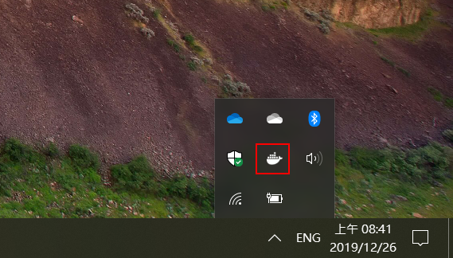
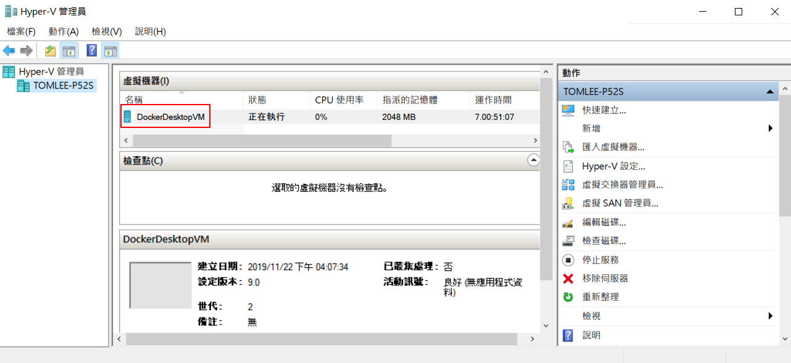

# Docker Desktop for Windows 與 Azure Kubernetes Service 實機操作

此實機操作練習是以 Windows 10 用戶運用 Linux 容器之情境所設計，並以 Microsoft Azure 相關容器服務作為練習的平台。請注意此系列操作練習目的在於建立容器應用基礎概念，相關組態配置並非考量真實營運環境的最佳架構。

在練習過程中使用 Azure Virtual Machines B2S 規格 VM 作為 Azure Kuberntes Service 節點，每一個節點每小時產生 NT$1.3 費用，實機操作練習完畢後只須將相關節點關機，就不再產生費用，而每個節點 Azure Managed Disk 費用每月 NT$158。 Azure Kubernetes Service 叢集是免費服務，Azure Container Regisrty 基本版則是每月產生約 NT$155 費用，Azure Kubernetes Service 用到的 Persistent Volume Claim 的 Azure Managed Disk 費用為每月每 GB NT$1.5。假若練習兩小時完畢後刪除所有內容，產生費用約 NT$15。

## Docker 與 Microsoft Windows 相關資源
* [Docker - 從入門到實踐正體中文版](https://philipzheng.gitbooks.io/docker_practice/content/)
* [Docker Hub](https://hub.docker.com/)
* [Windows 上使用容器文件首頁](https://docs.microsoft.com/zh-tw/virtualization/windowscontainers/)

## Azure Container Registry
* [Azure Container Registry 文件首頁](https://docs.microsoft.com/zh-tw/azure/container-registry/)

## Azure Kubernetes Service 相關資源
* [Kubernetes 官網](https://kubernetes.io/)
* [Brenden Burn 的 Kubernetes Basics 系列影片](https://www.youtube.com/playlist?list=PLLasX02E8BPCrIhFrc_ZiINhbRkYMKdPT) 
* [Azure Kubernetes Service 文件首頁](https://docs.microsoft.com/zh-tw/azure/aks/)
* [Kubernetes: Up and Running, Second Edition 電子書下載](https://azure.microsoft.com/en-us/resources/kubernetes-up-and-running/)

## Lab 0 準備工作，安裝 Docker Desktop for Windows
* 備妥 Windows 10 64 位元專業版，企業版或教育版 (Build 15063 之後版本)，家用版因為不支援 Hyper-V 無法使用
* BIOS 與 Windows 需啟用 Hyper-V 虛擬化環境
* 至 Docker Hub [註冊帳號並且下載](https://hub.docker.com/editions/community/docker-ce-desktop-windows) Docker Desktop for Windows(stable) 版本
* 執行安裝程式，安裝完畢後 Windows 工作列會顯示 Docker 圖示點選可進行相關設定

* 本實作練習採用 Linux 容器，啟用 Hyper-V 管理員可以看到 Docker Desktop for Windows 所建立的 Linux 虛擬機器

## 其他所需工具
* 下載安裝 [Visual Studio Code](https://code.visualstudio.com/Download) Windows 64 bit 版本
* 下載安裝 [Nodejs 12.xx](https://nodejs.org/zh-tw/download/) Windows 64 bit 版本

## Lab 5 之後會使用到 Microsoft Azure，需準備妥
*  Microsoft Azure [訂閱帳號](https://azure.microsoft.com/zh-tw/free/)
* 下載安裝 [Azure CLI 2.0.77](https://docs.microsoft.com/zh-tw/cli/azure/install-azure-cli?view=azure-cli-latest)之後版本 

## Lab 1 - Lab 8 內容說明
* [前往練習 Lab 1](Labs-01.md) : 驗證 Docker 環境正常運作
* [前往練習 Lab 2](Labs-02.md) : 以本機共享磁碟 Host Volume 方式建立 MySQL 8 容器
* [前往練習 Lab 3](Labs-03.md) : 以 Docker Compose 使用 Name Volume 方式建立 Wordpress 5.3 與 MySQL 8 容器
* [前往練習 Lab 4](Labs-04.md) : 建立一個 Nodejs 網頁程式之 Docker 映像檔與容器
* [前往練習 Lab 5](Labs-05.md) : 將 Docker 映像檔推送至 Azure Container Registry
* [前往練習 Lab 6](Labs-06.md) : 建立 Azure Kubernetes Service 叢集
* [前往練習 Lab 7](Labs-07.md) : 部署 Nodejs 網頁程式至 Azure Kubernetes Service 叢集
* [前往練習 Lab 8](Labs-08.md) : 部署使用 Persistent Volume Claim 的 Wordpress 與 MySQL 至 Azure Kubernetes Service 叢集
* [刪除所建立的 Azure 資源群組](Labs-clear.md)
